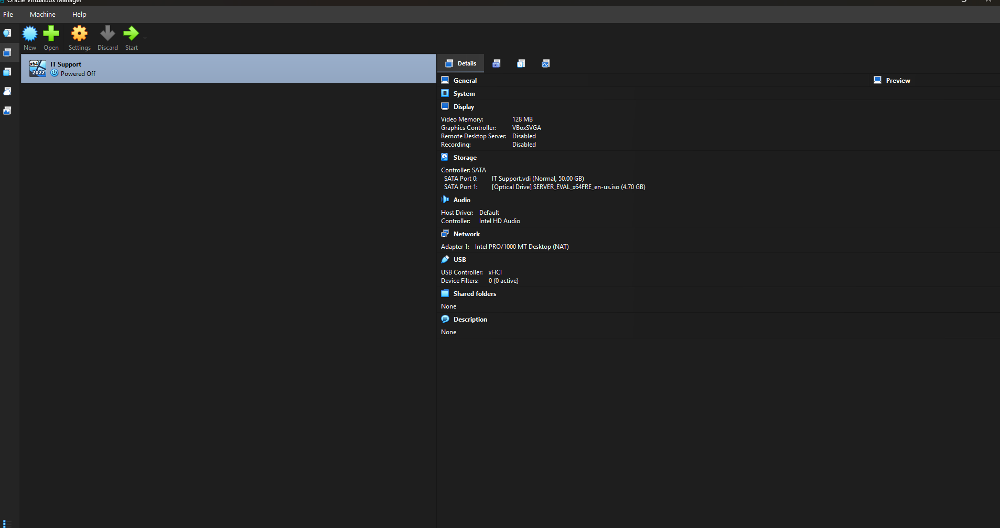
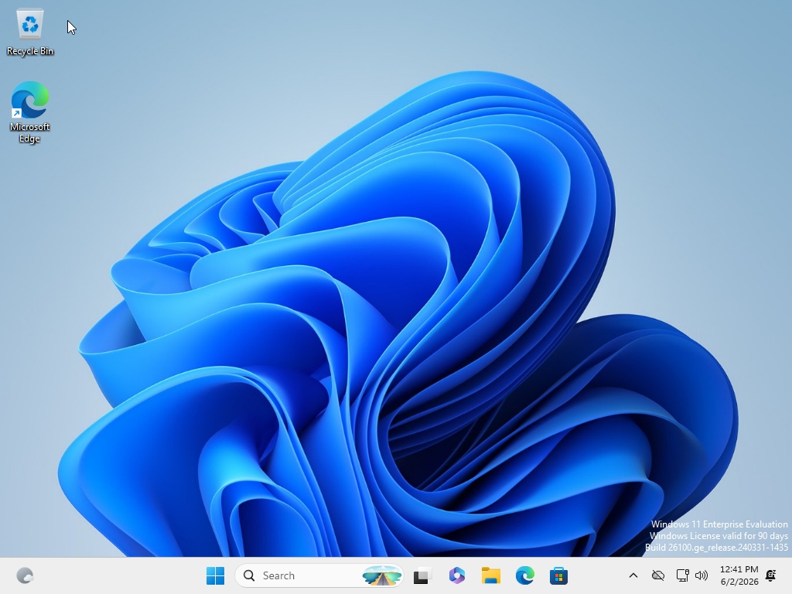
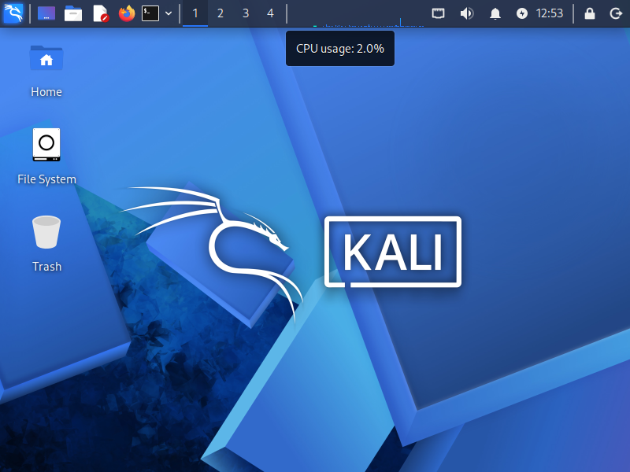
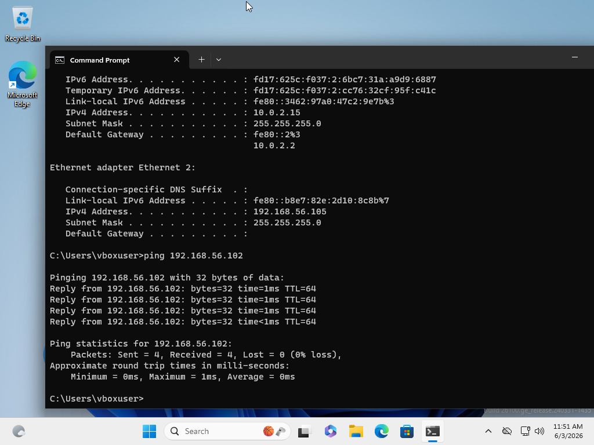
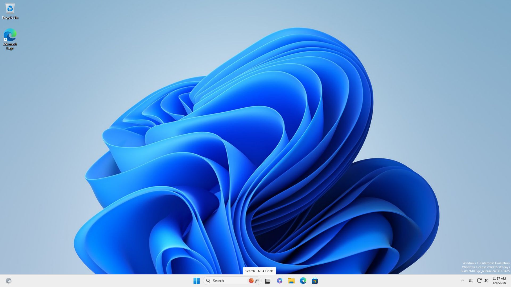
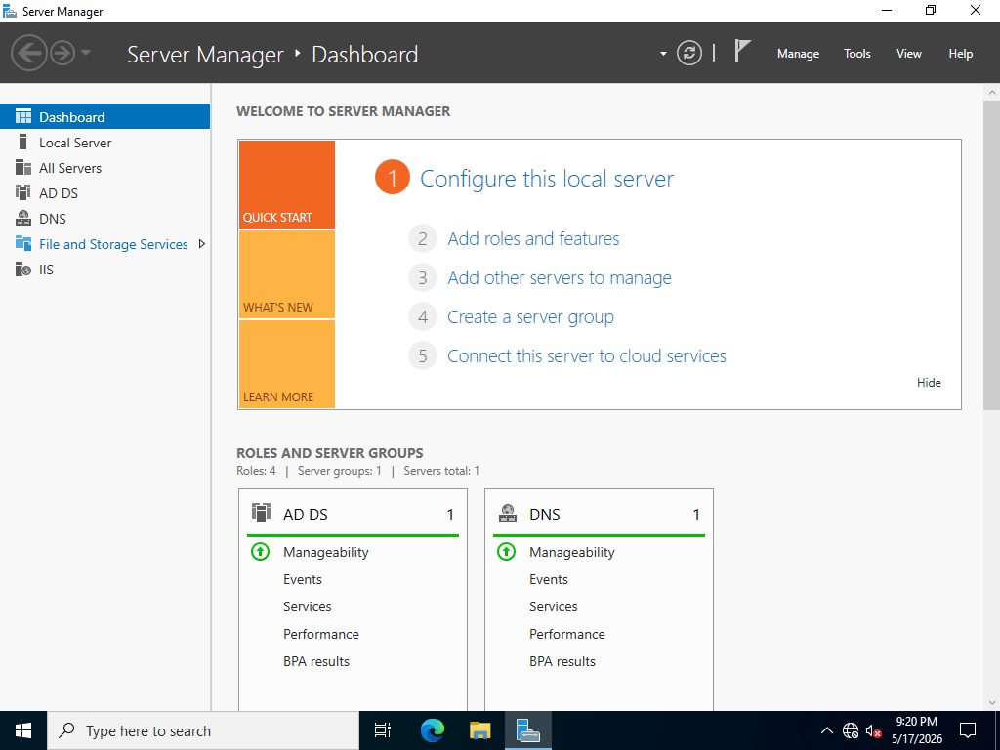
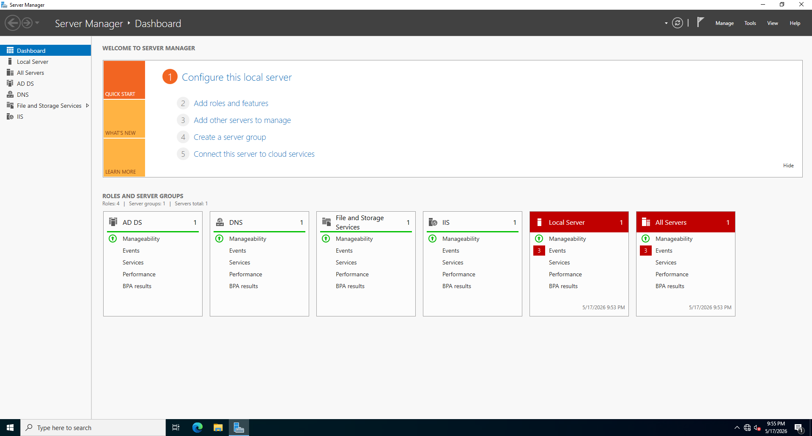

# Project – Segmented Cybersecurity Home Lab (VirtualBox)


---

## Overview

This project builds a **segmented two-machine virtual home lab** using VirtualBox, consisting of a **Windows 11 Enterprise defender machine** and a **Kali Linux attacker machine** connected over an isolated Host-Only network. The lab simulates a real attack surface where both offense and defense techniques can be practiced safely — without impacting any live systems or external networks.

The environment mirrors concepts used in professional SOC and penetration testing workflows, demonstrating hands-on understanding of virtualization, network segmentation, OS hardening, and attacker tooling.

---

## Environment

| Component | Details |
|-----------|---------|
| Hypervisor | Oracle VirtualBox |
| Defender VM | Windows 11 Enterprise Evaluation (Build 26100) |
| Attacker VM | Kali Linux (pre-built VirtualBox appliance) |
| Network | Isolated Host-Only Adapter (192.168.56.0/24) |
| Host OS | Windows (host machine running VirtualBox) |

---

## Lab Architecture

### Network Design

```
[ Host Machine ]
       |
  [ VirtualBox ]
   /           \
[WIN11]       [Kali]
NAT + Host-Only   Host-Only
192.168.56.105   192.168.56.102
```

- **Windows 11 (Defender):** Dual-adapter setup — NAT for internet access, Host-Only for lab communication
- **Kali Linux (Attacker):** Host-Only adapter only — isolated to the lab network, no direct internet routing
- **Server VM (IT Support):** Windows Server 2022 with AD DS, DNS, File and Storage Services, and IIS roles installed

> This segmentation ensures attacker traffic stays contained within the virtual network — a core principle of safe lab design.

---

## Build Phases

---

### Phase 1.1 — Install VirtualBox

**Actions Taken:**
1. Downloaded VirtualBox installer from virtualbox.org for the host OS
2. Ran installer with default settings; accepted the network adapter warning (expected behavior)
3. Installed the **VirtualBox Extension Pack** for USB 2.0/3.0 support
4. Confirmed VirtualBox Manager opened successfully


*VirtualBox Manager showing the IT Support VM (Windows Server 2022, Powered Off) — 50 GB VDI and Server 2022 evaluation ISO mounted on SATA Port 1*

---

### Phase 1.2 — Create the Windows Defender VM

**Actions Taken:**
1. Downloaded Windows 11 Enterprise Evaluation ISO from Microsoft Evaluation Center
2. Created VM: `WIN11-Defender` — Windows 11 (64-bit), 4096 MB RAM, 50 GB VDI (dynamically allocated)
3. Mounted ISO via Settings > Storage > Optical Drive
4. Completed Windows installation — skipped product key, selected Enterprise edition, used Custom Install
5. Created local account (bypassed Microsoft account requirement by temporarily disabling network)

**Outcome:** Windows 11 Enterprise desktop confirmed running. License valid for 90 days (evaluation). Build: `26100.ge_release.240331-1435`


*Windows 11 Enterprise Evaluation desktop after successful installation — Build 26100, license valid for 90 days (6/2/2026)*

---

### Phase 1.3 — Create the Kali Linux Attacker VM

**Actions Taken:**
1. Downloaded Kali Linux pre-built `.ova` appliance from kali.org/get-kali (VirtualBox image)
2. Imported via File > Import Appliance in VirtualBox
3. Started VM — default credentials used: `kali / kali`
4. Changed default password immediately using `passwd` in terminal

**Outcome:** Kali Linux desktop confirmed running. CPU usage at 2.0% at idle — VM is responsive and fully functional.


*Kali Linux desktop after successful import and login — CPU usage at 2.0%, 4 virtual workspaces available*

---

### Phase 1.4 — Configure an Isolated Network

**Actions Taken:**
1. Created a new **Host-Only network** in VirtualBox Host Network Manager (range: `192.168.56.0/24`)
2. Configured WIN11-Defender with **two adapters**: Adapter 1 = NAT, Adapter 2 = Host-Only
3. Configured Kali with **one adapter**: Host-Only only
4. On WIN11, ran `ipconfig` — confirmed:
   - NAT adapter: `10.0.2.15`
   - Host-Only adapter: `192.168.56.105`
5. From WIN11, ran `ping 192.168.56.102` — **4/4 packets received, 0% loss, 0–1ms RTT**

**Outcome:** Bidirectional connectivity confirmed between WIN11 and Kali over the isolated lab network.


*ipconfig output showing both adapters (NAT: 10.0.2.15, Host-Only: 192.168.56.105) and successful ping to Kali at 192.168.56.102 — 4/4 packets received, 0% loss*

---

### Phase 1.5 — Install VirtualBox Guest Additions + Windows Server Roles

**Actions Taken:**
1. On WIN11-Defender: inserted Guest Additions CD via Devices > Insert Guest Additions CD Image
2. Ran `VBoxWindowsAdditions.exe` — completed installation, restarted VM
3. Confirmed screen auto-resizes with VirtualBox window (full-resolution rendering active)
4. On the **IT Support (Windows Server 2022)** VM: configured Server Manager with the following roles:
   - **AD DS** (Active Directory Domain Services)
   - **DNS**
   - **File and Storage Services**
   - **IIS** (Internet Information Services)

**Outcome:** Guest Additions functional on defender VM. Server VM shows 4 installed roles with green Manageability status across AD DS, DNS, File and Storage Services, and IIS.


*Windows 11 Enterprise desktop with Guest Additions installed — screen auto-resizes to full resolution within the VirtualBox window*


*Server Manager Dashboard on Windows Server 2022 — AD DS and DNS roles showing green Manageability status (9:20 PM, 5/17/2026)*


*Server Manager expanded view showing all 4 installed roles: AD DS, DNS, File and Storage Services, and IIS — all healthy with green status (9:55 PM, 5/17/2026)*

---

## Skills Demonstrated

| Skill | How It Was Applied |
|-------|--------------------|
| Virtualization | Deployed and configured multiple VMs in VirtualBox including import of pre-built appliances |
| Network Segmentation | Designed isolated Host-Only network to contain attacker VM traffic |
| OS Installation & Configuration | Installed Windows 11 Enterprise and Kali Linux from scratch / appliance |
| Windows Server Administration | Installed and configured AD DS, DNS, IIS, and File Services via Server Manager |
| Network Troubleshooting | Used `ipconfig`, `ip a`, and `ping` to verify connectivity and diagnose adapter assignment |
| Security Mindset | Separated attacker/defender machines, changed default credentials, isolated lab network from production |
| Lab Documentation | Captured evidence at each phase with screenshots and verified outcomes |

---

## Lessons Learned

**Network isolation matters from day one.** Giving Kali internet access through NAT might seem convenient, but it breaks the isolation model — the attacker machine should only see the lab. Restricting Kali to Host-Only enforces this cleanly.

**Windows Server roles compound quickly.** Adding AD DS, DNS, IIS, and File Services to the IT Support VM immediately made the lab more realistic — a Windows domain environment opens up many more attack and defense scenarios than a standalone workstation.

**Guest Additions are worth it.** The quality-of-life improvement (clipboard sharing, auto-resize resolution) from Guest Additions significantly speeds up lab work. It's a small step that makes a real difference over long sessions.

---

## References

- [VirtualBox Downloads](https://www.virtualbox.org/wiki/Downloads)
- [Microsoft Evaluation Center – Windows 11 Enterprise](https://www.microsoft.com/en-us/evalcenter/evaluate-windows-11-enterprise)
- [Kali Linux Virtual Machines](https://www.kali.org/get-kali/#kali-virtual-machines)
- [MyDFIR Home Lab Part 1/3 – YouTube](https://www.youtube.com)
- [MyDFIR Home Lab Part 2/3 – YouTube](https://www.youtube.com)
- [MyDFIR Home Lab Part 3/3 – YouTube](https://www.youtube.com)
- [VirtualBox Documentation](https://www.virtualbox.org/wiki/Documentation)
